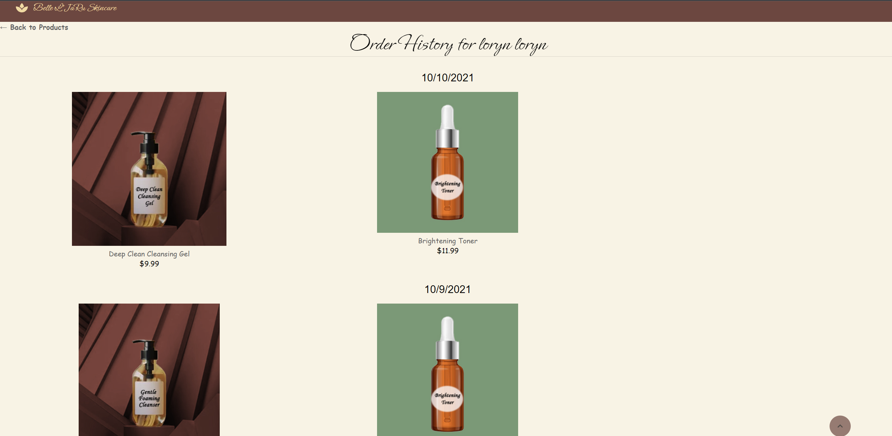

## <h1 align='center'> Belle L'JaRu Skincare </h1>

 URL of Heroku Deployed Application: 

 URL of Github Repository: https://github.com/jazcr/belle-ljru 

# Table of Contents
- [Description](#description)
- [View](#view)
- [Installation](#installation)
- [Built With](#built-with)
- [Credits](#credits)
- [Contributors](#contributors)
- [License](#license)

# Description
Welcome to **Belle L'JaRu**, the best skincare e-commerce store around! This MERN full-stack application allows users to shop best-selling, top-grade skincare products, create personal accounts, save purchase history and buy products using Stripe! Our personalized mutliple choice quiz allows users to find out what skin type they may have and gives a recommended routine with products for users to follow! Our motto is to love the skin you're in and our goal is to make everyone feel beautiful and confident in their own skin!

## View
- Walkthrough of store products, logging in and purchasing items using Stripe!

- Skin type quiz and routine pages

- Order History page 

## Installation
To start using this _Belle L'JaRu Skincare Store_ application you must follow these instructions:

* Fork and clone this repository and save it to your computer. For help how to fork and clone click [here](https://guides.github.com/activities/forking/) 

* Download Robo3T to test your database To download Robo3T click [here](https://robomongo.org/)

* Open your terminal and make sure noje.js is installed. To download node.js click [here](https://nodejs.org/en/download/)

* Run command _npm i_ to install all the dependencies in this repository. 

* After all dependecies have been installed, run seeds to seed and obtain the database for the store _npm run seed_

* Start the server, run _npm run develop_ to start your front end and back end server. Once servers are running the application will run in http://localhost:3000/ 

## Built With
- [React.js](https://reactjs.org/)- A JavaScript Library used for building user interfaces.
- [Express](https://expressjs.com/)- A Node.js web application server framework used to build web applications.
- [Node.js](https://nodejs.dev/learn) - An open-source, low-level, back-end JavaScript runtime platform that uses asynchronous programming and is a popular tool for almost any kind of project!
- [Apollo-Server-Express](https://www.npmjs.com/package/apollo-server-express) - An open-source GraphQL server that works with Node.js.
- [MongoDB](https://www.mongodb.com/)- A popular NoSQL database management program.
- [GraphQL](https://graphql.org/) - A query language for APIs.
- [Stripe](https://stripe.com/docs/stripe-js) - A JavaScript library for taking payments
- [Material-UI](https://mui.com/) - A React styling library to create responsive and amazing designs for you webpage
- [React-Parallax](https://www.npmjs.com/package/react-parallax) - A fun background component that allows users to create interesting scrolling background effects for their webpage 

## Credits
- React Multiple Choice Quiz [tutorial](https://mitchgavan.com/react-quiz/)
- Reference for routine [cards](https://github.com/irfanabliz/personality-test-react)

## Contributors

[Jasmine Rudolph](https://github.com/jazcr)

[Loryn Haykus](https://github.com/lhaykus)

[Rubidia Rubio](https://github.com/rubiocode)

## License

Copyright 2021 Rubidia Rubio. Licensed under the [MIT License](https://opensource.org/licenses/MIT)

All Rights Reserved. Permission is hereby granted, free of charge, to any person obtaining a copy of this software and associated documentation files (the "Software"), to deal in the Software without restriction, including without limitation the rights to use, copy, modify, merge, publish, distribute, sublicense, and/or sell copies of the Software, and to permit persons to whom the Software is furnished to do so, subject to the following conditions:

The above copyright notice and this permission notice shall be included in all copies or substantial portions of the
Software.

THE SOFTWARE IS PROVIDED "AS IS", WITHOUT WARRANTY OF ANY KIND, EXPRESS OR IMPLIED, INCLUDING BUT NOT LIMITED TO THE
WARRANTIES OF MERCHANTABILITY, FITNESS FOR A PARTICULAR PURPOSE AND NONINFRINGEMENT. IN NO EVENT SHALL THE AUTHORS OR
COPYRIGHT HOLDERS BE LIABLE FOR ANY CLAIM, DAMAGES OR OTHER LIABILITY, WHETHER IN AN ACTION OF CONTRACT, TORT OR
OTHERWISE, ARISING FROM, OUT OF OR IN CONNECTION WITH THE SOFTWARE OR THE USE OR OTHER DEALINGS IN THE SOFTWARE.